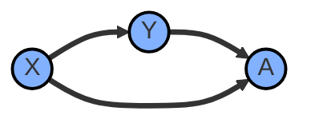

[07-Normalizzazione](<file:///Users/enrico/Library/Mobile Documents/com~apple~CloudDocs/Universita/secondo anno/base dati/slide/07-Normalizzazione.pdf>)

Una forma normale è una proprietà di uno schema relazionale che ne garantisce la "qualità" (efficienza nelle rappresentazioni). La normalizzazione si applica generalmente nella progettazione logica, ma se si applica già a partire da quella relazionare si semplificano notevolmente le cose.
#### Ridondanza Concettuale:
sono memorizzate informazioni che possono essere derivare da altre già contenute nel DB.

#### Ridondanza Logica:
esistono duplicazione sui dati che portano, oltre allo spreco di memoria, anche alla generazione di anomalie nelle operazioni sui dati: Anomalia di aggiornamento, anomalie di inserimento e anomalie di cancellazione. Ci sono casi in cui la duplicazione di certi dati non porta a nessun tipo di problema.
Un modo per eliminare le ridondanze logiche è mediante la scomposizione degli schemi. 

>le ridondanze logiche sono causate generalmente da errori durante la progettazione concettuale o da errate traduzioni di schemi E/R in schemi relazionari.

#### Dipendenza funzionale:
si introduce un nuovo vincolo, la dipendenza funzionale (FD), per formalizzare i problemi visti prima.
- Si considerino:
    - uno schema di relazione $R(T)$ e un'estensione $r$;
    - due sottoinsiemi (non vuoti) di $T$ denominati $X$ e $Y$ rispettivamente.

- Si dice che in $r$ **vale la dipendenza funzionale** $X \rightarrow Y$ (**$X$ determina funzionalmente $Y$**) se:

$$\forall t_1, t_2 \in r : t_1[X] = t_2[X] \implies t_1[Y] = t_2[Y]$$

cioè per ogni coppia di tuple $t_1$ e $t_2$ di $r$ con gli stessi valori su $X$, $t_1$ e $t_2$ hanno gli stessi valori anche su $Y$.

Rappresentano una generalizzazione dei vincoli di chiave, è una particolare caratteristica dello schema R(T), quindi dell'espetto intensionale, e non di quello estensionale. Se K è una chiave in uno schema R(T) allora ogni altro attributo di R(T) dipende funzionalmente da K.

## Forme Normali
 Si definiscono UNF le relazioni che non sono conformi a nessuna forma normale.
 Nella pratica si arriva fino alla 3 forma normale.
![[Screenshot 2026-07-08 at 11.51.17.png|308]] 
Il processo di normalizzazione fu introdotto da Codd: nel 1970 con la definizione del modello relazionale, nel 1971 con la definizione di 1NF e nel 1972 con la definizione di 2NF e 3NF. Nel 1974 Boyce e Codd definirono una forma più restrittiva di 3NF denominata BCNF. Tutte queste forme normali si basano sulle dipendenze funzionali tra gli attributi di una relazione.

### 1NF
***def***: Uno schema R(T) è in 1NF se e solo se il <u>dominio di ciascun attributo comprende solo valori atomici</u> (semplici, indivisibili) e il valore di ciascun attributo in una tupla è un valore singolo del dominio di quell'attributo.

Quindi non sono permesse "relazioni dentro relazioni" e "relazioni come attributi di tuple". I soli valori di attributi ammissibili sono i singoli valori atomici rispetto al RDMBS. È importante comprendere il termine "non-scomponibilità": l'importante è che ogni valore dell'attributo dia dal punto di vista semantico un'informazione unica.

- es: si condidera lo schema DIPARTIMENTI(<u>CodDip</u>, Nome, CodDir, SediDip) e lo stato: 
	![[Screenshot 2026-07-08 at 12.02.10.png|392]]
	la relazione non è in 1NF a causa dell'attributo SediDip. Ci sono vari modi per risolvere questo problema e portare la relazione in 1NF, quello più efficace è rimuovere l'attributo SediDip e porlo in un'altra relazione separata con chiave combinazione di CodDip e SedeDip:
	![[Screenshot 2026-07-08 at 12.04.37.png|400]]
	Questa soluzione non presenta ridondanze ed è completamente generale.

### 2NF
- ***Attributo primo***: un attributo $A \in T$ è <u>primo</u> $\iff$ fa parte di almeno uno chiave dello schema. In caso contrario è detto <u>non-primo</u>.

***def***: Uno schema R(T) con vincoli F è in 2NF se e solo se ogni attributo <u>non-primo</u> dipende completamente (non parzialmente) da ogni chiave candidata dello schema, ovvero se non c'è <u>dipendenza parziale</u> di un attributo non-primo da una chiave.

Uno schema in 1NF le cui chiavi siano tutte "semplici", ovvero formate da un singolo attributo, è automaticamente anche in 2NF.

- es: MAGAZZINI(<u>Articolo</u>, <u>Magazzino</u>, Quantità, Indirizzo)
	la soluzione consiste nell'estrarre la FD che crea problemi:
	ARTICOLI_IN_MAGAZZINI(<u>Articolo</u>, <u>Magazzino</u>, Quantità) (AM -> Q)
	INDIRIZZI_MAGAZZINI(<u>Magazzino</u>, Indirizzo) (M -> I)
	![[Screenshot 2026-07-08 at 12.22.12.png|503]]

- altro es: Una relazione in cui non vi sono dipendenze funzionali parziali dalla chiave primaria non è in tutti i casi in 2NF: consideriamo questo schema PRODUTTORI(Produttore, Modello, <u>NomeModelloCompleto</u>, Stato)
	![[Screenshot 2026-07-08 at 12.24.14.png|493]] 
	Una chiave candidata è anche {Produttore, Modello} ma Produttore -> Stato (dipendenza parziale). La trasformazione in 2NF prevede due relazioni: PRODUTTORI_SPAZZOLINI(<u>Produttore</u>, Stato) e MODELLI_SPAZZOLINI(<u>Produttore</u>, <u>Modello</u>, NomeModelloCompleto)

### 3NF

- **Dipendenza transitiva**: dato uno schema $R(T)$, $X \subseteq T$, $A \in T$, $A$ dipende transitivamente da $X$ se esiste $Y \subset T$ tale che:

	1. $X \rightarrow Y$ $\quad$ {$X$ determina $Y$}
	2. $\neg(Y \rightarrow X)$ $\quad$ {$Y$ non determina $X$}
	3. $Y \rightarrow A$ $\quad$ {$Y$ determina $A$}
	4. $A \notin Y$ $\quad$ {...non banalmente}

***def***: Uno schema R(T) con vincoli F è in 3NF se e solo se <u>ogni attributo non-primo non dipende transitivamente da nessuna chiave</u> ovvero se non c'è dipendenza transitiva di un attributo non-primo da una chiave.

- es: consideriamo il seguente schema in 2NF, IMPIEGATI(<u>IdImpiegato</u>, Cognome, Nome, Agenzia, Luogo) con FD: IdImpiegato -> Cognome, Nome, Agenzia, Luogo (I -> CNAL) e Agenzia -> Luogo (A -> L)
	![[Screenshot 2026-07-08 at 15.48.07.png|416]]
	problema è che L dipende transitivamente dalla chiave I. 
	La soluzione consiste nell'estrarre la FD che crea i problemi generando due schemi: 
	IMPIEGATI_AGENZIE(<u>IdImpiegato</u>,Cognome,Nome,Agenzia) (I -> CNA);
	AGENZIE(<u>Agenzia</u>,Luogo) (A -> L).
	![[Screenshot 2026-07-08 at 16.50.49.png|337]]![[Screenshot 2026-07-08 at 16.51.00.png|219]]

***def*** (equivalente): Uno schema R(T) con vincoli F è in 3NF se e solo se, per ogni dipendenza funzionale non banale X -> Y definita su R(T), X è una superchiave di R(T) oppure ogni attributo A in Y è contenuto in almeno una chiave di R(T), cioè A è un attributo primo.

- es: in IMPIEGATI(<u>IdImpiegato</u>, Cognome, Nome, Agenzia, Luogo) analizzato precedentemente si può anche giustificare il fatto che non sia in 3NF perché nella dipendenza Agenzia -> Luogo si ha che Agenzia non è superchiave e Luogo è un attributo non-primo.

### esempio riepilogativo:
si consideri il seguente schema: 
TEST_LAB (<u>MatrStudente</u>, NomeStudente, <u>CodCorso</u>, NomeCorso, CodTitolare, NomeTitolare, CodEsaminatore, NomeEsaminatore, <u>DataProva</u>, Voto);

informazioni aggiuntive: sono registrate anche prove non superate. Un corso un solo professore titolare che non coincide necessariamente con il professore esaminatore. 
Prima di tutto è necessario individuare tutte le FD:
- $FD_{1}$:  <u>MatrStudente</u> -> NomeStudente
- $FD_{2}$:  <u>CodCorso</u> -> NomeCorso
- $FD_{4}$:  <u>CodCorso</u> -> CodTitolare
- $FD_{4}$:  CodTitolare -> NomeTitolare
- $FD_{5}$:  CodEsaminatore -> NomeEsaminatore
le prime tre sono dipendenze parziali perché l'attributo determinante è una parte della chiave, le ultime due sono dipendenze transitive perché dipendono transitivamente da altri attributi. A causa delle dipendenze parziali la relazione non è in 2NF. 

- Per normalizzare a 2NF si devono spezzare le dipendenze parziali:
	 - PROVE_LAB (<u>MatrStudente</u>: STUDENTI, CodCorso: CORSI, CodEsaminatore, NomeEsaminatore, <u>DataProva</u>, Voto)
	 - STUDENTI (<u>MatrStudente</u>, NomeStudente)
	 - CORSI (<u>CodCorso</u>, NomeCorso, CodTitolare, NomeTitolare)

- Per normalizzare a 3NF si devono poi risolvere le dipendenze funzionali transitive:
	- PROVE_LAB(<u>MatrStudente</u>:STUDENTI,<u>CodCorso</u>:CORSI, CodEsaminatore: PROFESSORI, <u>DataProva</u>, Voto);
	- PROFESSORI (CodProfessore, NomeProfessore) (include Esaminatori e Titolari);
	- STUDENTI (MatrStudente, NomeStudente);
	- CORSI (CodCorso, NomeCorso, CodTitolare: PROFESSORI).

### BCNF:
forma normale più restrittiva di 3NF, estende le considerazioni sinora svolte anche agli attributi primi.

***def***: Uno schema R(T) con vincoli F è in BCNF se, per ogni dipendenza funzionale (non banale) X -> Y definita su di esso, X è una superchiave di R(T).

## Qualità di decomposizione:
- deve essere senza perdità:
	bisogna evitare che la decomposizione alteri il contenuto informativo del DB, per evitare ciò si introduce un requisito:
	 Uno schema R(X) si decompone senza perdita negli schemi $R_{1}(X_{1})$ e $R_{2}(X_{2})$ se, per ogni stato legale $r$ su $R(X)$, il join naturale delle proiezioni di $r$ su $X_{1}$ e $X_{2}$ è uguale a $r$ stessa: $$
		\pi _{X_{1}}(r) \bowtie \pi_{X_{2}(r)}=r
	  $$ è necessario e sufficiente che il join naturale sia eseguito su una superchiave di uno dei due sottoschemi, deve valere 
	  $$
		X_1 \cap X_2 \rightarrow X_1 \quad \lor \quad X_1 \cap X_2 \rightarrow X_2
	  $$
	  quindi bisogna inserire in un unica relazione tutti gli attributi che servono per verificare le dipendenze, se vengono separati in più relazioni, sarà impossibile all'inserimento di una nuova istanza verificare le dipendenze.
  
- dovrebbe preservare le dipendenze:
	Una decomposizione preserva le dipendenze se ciascuna delle dipendenze funzionali dello schema originario coinvolge attributi che compaiono tutti insieme in uno degli schemi decomposti.

### Algoritmo di decomposizione in 3NF:
L'idea di base consiste nel creare una relazione per ogni gruppo di FD che hanno lo stesso lato sinistro e inserire nello schema corrispondente gli attributi coinvolti in almeno una FD del gruppo.
	 es: 
	 -schema -> R(<u>AB</u>CDEFG)
	 -FD: AB -> CD, AB -> E, C -> F, F -> G
	 -si generano: R1(<u>AB</u>CDE), R2(<u>C</u>F), R3(<u>F</u>G)
Nel caso in cui 2 o più determinanti si determinano reciprocamente, si fondono gli schemi.
Alla fine si verifica che esiste uno schema la cui chiave è anche chiave dello schema originale, se non esiste lo si crea apposta.

Nel caso particolare in cui una FD sia composta da tutti gli attributi di una relazione, non esiste nessuna decomposizione che riesce a preservare quella determinata dipendenza!

### Esercizio: BCNF e perdita di dipendenze
Si consideri lo schema ESAMI(<u>Studente</u>, <u>Corso</u>, Esaminatore, DataEsame, Voto) con l'ipotesi che un esaminatore possa svolgere esami per un solo cors<u></u>o:
$$Esaminatore \rightarrow Corso$$

- Chiavi candidate: {Studente, Corso, DataEsame} e {Studente, Esaminatore, DataEsame} (equivalenti grazie a Esaminatore -> Corso). Corso è quindi un **attributo primo**.
- Lo schema è in **3NF** perché nella FD Esaminatore -> Corso il determinato (Corso) è un attributo primo.
- **NON è in BCNF** perché Esaminatore non è una superchiave.

Una possibile decomposizione:
- ESAMI(<u>Studente</u>, <u>Esaminatore</u>, <u>DataEsame</u>, Voto)
- ESAMINATORI_CORSI(<u>Esaminatore</u>, Corso)

>[!warning] Problema: perdita di dipendenze
>Le due relazioni sono in BCNF, ma è **impossibile verificare** la FD `Studente, Corso -> Esaminatore` su una qualsiasi delle due relazioni: la decomposizione **non preserva le dipendenze**. Non si può impedire l'inserimento di due esami dello stesso studente per lo stesso corso con esaminatori diversi, se non facendo riferimento contemporaneamente a entrambe le relazioni.

## Progett<u></u>azione e Normalizzazione
La teoria della normalizzazione può essere usata:
- nella **progettazione logica**, per verificare la qualità dello schema relazionale finale;
- nella **progettazione concettuale**, per verificare la qualità dello schema E/R.

- es: sfruttando la FD `PartitaIVA -> NomeFornitore, IndirizzoFornitore` (e rinominando alcuni attributi) uno schema PRODOTTO con dentro i dati del fornitore si ristruttura correttamente in tre concetti:
	PRODOTTO --(FORNITURA)-- FORNITORE

### FD e modello E/R
È bene abituarsi a "leggere" uno schema E/R anche in termini di FD, considerando le **cardinalità massime** delle associazioni.
- Se un'entità $E_1$ partecipa a un'associazione $R$ con cardinalità massima pari a 1 `(1,1)`, allora la sua chiave determina funzionalmente la chiave dell'altra entità e gli attributi dell'associazione:
$$K_1 \rightarrow K_2, A_R \quad \text{poiché max-card}(E_1,R)=1$$

### Analisi di associazioni n-arie
Le associazioni n-arie spesso nascondono FD che possono dar luogo a schemi non normalizzati.

- es: associazione TESI tra Studente, Professore, Dipartimento e CorsoDiLaurea:
	- $Studente \rightarrow CorsoDiLaurea$
	- $Studente \rightarrow Professore$
	- $Professore \rightarrow Dipartimento$

	Lo schema TESI(<u>Studente</u>, Professore, Dipartimento, CorsoDiLaurea) **non è in 3NF** a causa della dipendenza transitiva $Professore \rightarrow Dipartimento$.
	![[Screenshot 2026-07-09 at 09.38.48.png|341]]

- **1° ristrutturazione**: si crea l'associazione diretta AFFERENZA tra Professore e Dipartimento. Lo schema diventa TESI(<u>Studente</u>, Professore, CorsoDiLaurea), ora in **BCNF**.
	![[Screenshot 2026-07-09 at 09.39.51.png|351]]
- **2° ristrutturazione**: TESI include in realtà 2 FD tra loro **indipendenti**:
	- $Studente \rightarrow CorsoDiLaurea$ (iscrizione)
	- $Studente \rightarrow Professore$ (relatore, solo per chi ce l'ha)

	Conviene quindi separarle in due associazioni distinte: ISCRIZIONE (Studente-CdL) e TESI (Studente-Professore).
	![[Screenshot 2026-07-09 at 09.40.04.png|357]]

### Possiamo fare a meno delle FD?
Anche se una buona progettazione concettuale spesso rende superfluo ragionare in termini di FD, esistono schemi E/R "corretti" che danno luogo a schemi relazionali non normalizzati.

- es: vincolo per cui si possono scegliere solo corsi offerti dal proprio CdL. L'associazione SCELTA genera:
	SCELTE(CdL, CodCorso, PS_Cod, Anno)
	La vera chiave è {CodCorso, PS_Cod}, ma a causa della dipendenza parziale $PS\_Cod \rightarrow CdL$ lo schema **non è in 2NF**. La traduzione corretta in 3NF è:
	SCELTE(<u>CodCorso</u>, <u>PS_Cod</u>, Anno)

### È sempre opportuno normalizzare?
La normalizzazione **non è un obbligo**: in alcune situazioni le anomalie degli schemi non normalizzati sono un male minore rispetto a ciò che si otterrebbe normalizzando. Aspetti da considerare:
- **Prestazioni**: normalizzare elimina le anomalie ma può appesantire certe operazioni (join tra gli schemi normalizzati).
- **Dinamicità dei dati**: relazioni "quasi statiche" danno meno problemi se non normalizzate.
- **Costi di ridondanza**: vanno quantificati (occupazione di memoria + costi di aggiornamento delle repliche).